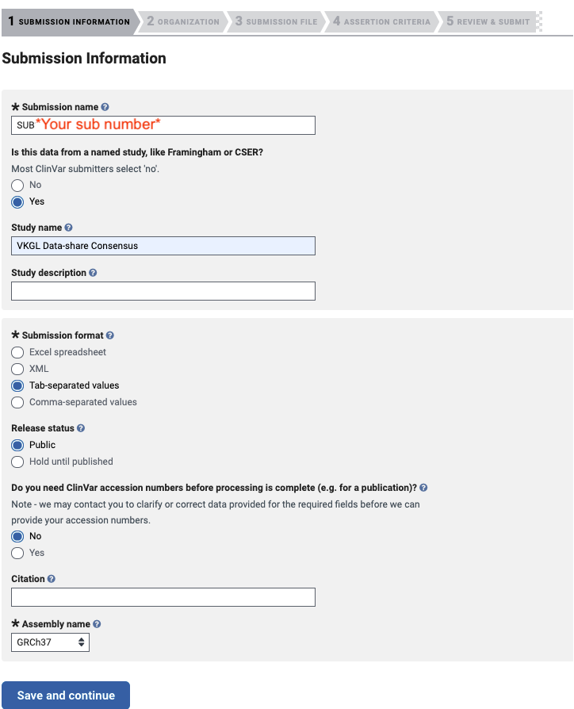

[](https://app.travis-ci.com/molgenis/vkgl-clinvar)
[](https://sonarcloud.io/dashboard?id=molgenis_vkgl-clinvar-submission)

## Requirements
- Java 17

## Usage
```
usage: java -jar vkgl-clinvar-writer.jar -i <arg> [-m <arg>] [-c <arg>] -o
       <arg> -r <arg> [-dd] [-s] [-f] [-d]
 -i,--input <arg>          VKGL consensus file (tsv).
 -m,--mappings <arg>       Mapping log files from previous run with this
                           tool.
 -c,--clinVar <arg>        ClinVar Submission reports from previous
                           submission, format: lab1=report
                           path,lab2=report path
 -o,--output <arg>         Directory to write output to.
 -r,--release <arg>        Release name to use in ClinVar file names.
 -s,--include_single_lab   Flag to indicate that single lab submissions
                           should also be submitted.
 -f,--force                Override the output files if output directory
                           already exists.
 -d,--debug                Enable debug mode (additional logging).

usage: java -jar vkgl-clinvar-writer.jar -v
 -v,--version   Print version.
```

## Existing ID's
__Always provide__ the "-dl" deleted accessions from the previous run, these are necessary because a reintroduced variant should be an update.
The deleted accessions of a run can be found in "*_REMOVED_log.tsv" 

There is a bit of hocus pocus going on around the ClinVar SCV's (identifiers), mainly because at this point we are not sure what to do with records that were submitted to ClinVar but became duplicates in the new release, or records that were removed from the consensus.
2 options are in play for annotating the new ClinVar release files with the correct SCV's:
'm' / 'mappings': Here the 'identifier' files from previous release can be provided, 4 of these are available, depending on what was submitted they should be provided:
- *_UNCHANGED_log.tsv: __always provide this one__, it contains identifiers for unchanged record, those are not resubmitted.
- *_UPDATED_log.tsv: don't provide those, updated record SCV's are obtained from the ClinVar Submission report.

'c' / 'clinVar': Here the submission report from ClinVar for the previous release should be provided for each lab. The argument is a comma separated list of key=value pairs.

The flow of this tool expects that all labs are submitted every cycle, if submits for a subset of labs were performed some manual work may be needed.
e.g. adding the "Updated" identifier file as well but removing lines for the labs that were submitted from it first.

## Current limitation - No SV support
Variant longer than 15 nucleotides are not submitted, ClinVar has slightly different rules for these variants that are not yet implemented.

## Deletes
A ```.Deletes``` sheet is created for every lab, containing accessions that are no longer present or valid.
Accession can become invalid if:
- The consensusline is based on a single lab and the "include single lab" flag is false.
- If the consensus status has become "disagreement" or "total_disagreement"

## Duplicates
Since version 1.1.x the most severe variant is submitted to ClinVar in case of duplicates.
If multiple duplicates have the same classification these duplicates are sorted alphabetically on genename, and the first one is selected.
If more than one ClinVar accession is found for a single lab for the list of duplicates an exception is thrown, since this should not be possible since we never submitted any duplicates to ClinVar.

## Submission

1. Make sure you are permitted to submit variants for the lab(s) you want to submit for. Go to
   the [ClinVar submission portal](https://submit.ncbi.nlm.nih.gov/clinvar/) and login.
2. Scroll down to the organisation you want to submit for.
3. Click on "Upload new file submission".
4. Select the following options:
   
   The submission name will be generated for you. Click Save and Continue.
5. In the next step, select `Single organization` for the first question. Then, if you're submitting
   for your own lab, select "No" and if you're submitting for another lab, select "Yes" and specify
   your own lab in the dropdown (there usually is one option).
6. Now it's time to upload your submission file. For now, we just upload the 
   `lab_yyyymmName.Variant.tsv`-file. Wait for it to upload (when the delete button becomes visible)
   and click "Save and continue".
7. Click "Save and continue" again in the "Assertion criteria"-step.
8. Review the options you've selected. Make sure the "Submission description" is set to 
   "VKGL Data-share Consensus". Then click "Validate and stop if there are errors". Now you should
   wait until you get an email telling you there are errors. You can download the file to find out
   what's wrong. Fix them. If your submission succeeded, you will receive an email with 
   "Acknowledgement of our submission to ClinVar (SUBXXX)". Now all you need to do is wait until you
   receive an email from ClinVar with the subject "Your submission is 100% complete (SUBXXX)". 
   Please be aware that ClinVar takes some time to index the newly added submissions, so it might
   take about two days for the new variants to become available through search.